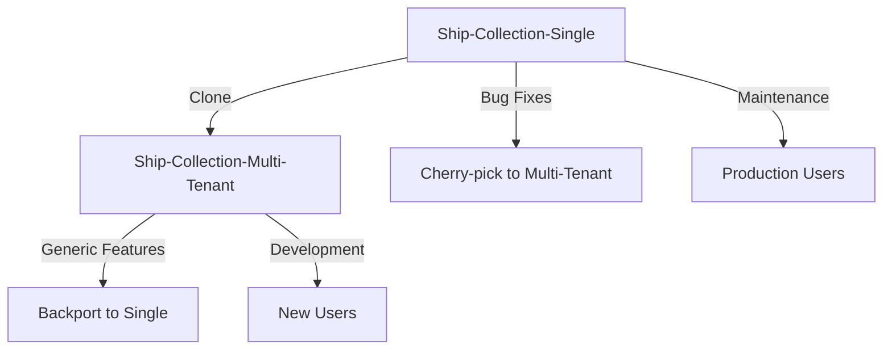

# Development Workflow: Parallel Single/Multi-Tenant Development

## Overview

This document outlines the comprehensive development workflow for maintaining both the single-user MongoDB application and developing the new multi-tenant Supabase application in parallel. This ensures continuous support for existing users while enabling innovation in the multi-tenant version.

## Repository Architecture

### Repository Separation Strategy

#### Current Repository: `Ship-Collection-Single`
- **Purpose**: Stable single-user application maintenance
- **Technology Stack**: Next.js + MongoDB + Mongoose
- **Development Focus**: Bug fixes, security updates, critical patches
- **User Base**: Existing single-user installations
- **Deployment**: Existing Docker/production setup

#### New Repository: `Ship-Collection-Multi-Tenant`
- **Purpose**: Modern multi-tenant platform development
- **Technology Stack**: Next.js + Supabase + PostgreSQL + Docker
- **Development Focus**: New features, scalability, multi-user capabilities
- **User Base**: New multi-tenant installations
- **Deployment**: Docker Compose with Supabase stack

### Repository Relationship



## Development Environment Setup

### Single-User Repository Setup
```bash
# Existing environment (no changes needed)
git clone https://github.com/user/Ship-Collection-Single.git
cd Ship-Collection-Single
npm install
cp .env.example .env.local
npm run dev
```

### Multi-Tenant Repository Setup
```bash
# New environment with Supabase
git clone https://github.com/user/Ship-Collection-Multi-Tenant.git
cd Ship-Collection-Multi-Tenant
chmod +x scripts/*.sh
./scripts/setup-local-env.sh
npm install
npm run docker:up
npm run dev
```

## Branching Strategy

### Single-User Repository (`Ship-Collection-Single`)

#### Branch Structure
```
main (production-ready)
├── hotfix/security-patch-2025-07
├── hotfix/mongodb-connection-fix
└── maintenance/dependency-updates
```

#### Branch Naming Conventions
- `hotfix/*` - Critical production fixes
- `maintenance/*` - Dependency updates, non-breaking improvements
- `docs/*` - Documentation updates

#### Development Process
1. **Critical Issues Only**: Focus on stability and security
2. **Minimal Changes**: Avoid architectural modifications
3. **Backward Compatibility**: Maintain existing functionality
4. **Quick Review Cycle**: Fast approval for critical fixes

### Multi-Tenant Repository (`Ship-Collection-Multi-Tenant`)

#### Branch Structure
```
main (stable development)
├── feature/supabase-auth-integration
├── feature/admin-portal
├── feature/user-collection-management
├── feature/real-time-updates
├── bugfix/rls-policy-fixes
└── release/v1.0.0-beta
```

#### Branch Naming Conventions
- `feature/*` - New functionality development
- `bugfix/*` - Bug fixes and improvements
- `release/*` - Release preparation branches
- `hotfix/*` - Critical fixes to main
- `docs/*` - Documentation updates

#### Development Process
1. **Feature-Driven Development**: Full feature implementation
2. **Modern Best Practices**: Latest tools and patterns
3. **Comprehensive Testing**: Full test coverage
4. **Code Review**: Thorough review process

## Code Synchronization Strategy

### Bug Fix Propagation

#### From Single-User to Multi-Tenant
```bash
# In multi-tenant repository
git remote add single-user https://github.com/user/Ship-Collection-Single.git
git fetch single-user

# Cherry-pick specific bug fixes
git cherry-pick <commit-hash>

# Or create equivalent fix for different architecture
git checkout -b bugfix/port-from-single
# Implement similar fix adapted for Supabase architecture
```

#### From Multi-Tenant to Single-User
```bash
# In single-user repository
git remote add multi-tenant https://github.com/user/Ship-Collection-Multi-Tenant.git
git fetch multi-tenant

# Evaluate if feature is applicable
# If yes, create simplified version
git checkout -b maintenance/feature-from-multi
# Implement simplified version without multi-tenant dependencies
```

### Feature Evaluation Matrix

| Feature Type | Single-User Eligibility | Implementation Approach |
|--------------|------------------------|------------------------|
| UI/UX Improvements | ✅ High | Direct port |
| Performance Optimizations | ✅ High | Adapt for MongoDB |
| Security Enhancements | ✅ High | Equivalent implementation |
| Bug Fixes | ✅ High | Direct port or equivalent |
| Multi-tenant Features | ❌ Low | Not applicable |
| Authentication Changes | ❌ Low | Single-user doesn't need |
| Database Schema Changes | ⚠️ Medium | Evaluate on case-by-case |

## Development Workflow Processes

### Daily Development Routine

#### Single-User Repository
```bash
# Morning routine
git pull origin main
npm run lint
npm run type-check
npm test

# Work on critical issues only
git checkout -b hotfix/issue-description
# Make minimal, focused changes
git commit -m "Fix critical issue: description"
git push origin hotfix/issue-description

# Create PR with thorough testing notes
```

#### Multi-Tenant Repository
```bash
# Morning routine
git pull origin main
npm run docker:up
npm run lint
npm run type-check
npm test

# Feature development
git checkout -b feature/new-functionality
# Full feature implementation
npm run test:watch # During development
git commit -m "feat: implement new functionality"
git push origin feature/new-functionality

# Create PR with comprehensive testing
```

### Release Management

#### Single-User Release Process
```bash
# Create maintenance release
git checkout -b maintenance/v2.x.x
# Include only critical fixes
git tag v2.x.x
git push origin v2.x.x

# Deploy to production
docker build -t ship-collection-single:v2.x.x .
docker push ship-collection-single:v2.x.x
```

#### Multi-Tenant Release Process
```bash
# Create release branch
git checkout -b release/v1.x.x
# Final testing and documentation
npm run test:full
npm run docker:test

# Create release
git tag v1.x.x
git push origin v1.x.x

# Deploy with Docker Compose
docker-compose -f docker-compose.prod.yml up -d
```

## Testing Strategy

### Single-User Repository Testing
```bash
# Minimal testing for stability
npm run test:critical          # Core functionality only
npm run test:regression        # Existing feature preservation
npm run lint                   # Code quality
npm run type-check            # TypeScript validation
```

### Multi-Tenant Repository Testing
```bash
# Comprehensive testing strategy
npm run test:unit             # Unit tests
npm run test:integration      # API integration tests
npm run test:e2e              # End-to-end user flows
npm run test:rls              # Row-level security tests
npm run test:performance      # Performance benchmarks
npm run lint                  # Code quality
npm run type-check           # TypeScript validation
npm run test:docker          # Docker environment tests
```

### Test Configuration Files

#### Single-User (jest.config.js)
```javascript
module.exports = {
  testEnvironment: 'node',
  testMatch: [
    '**/tests/critical/**/*.test.js',
    '**/tests/regression/**/*.test.js'
  ],
  collectCoverageFrom: [
    'pages/api/**/*.js',
    'lib/**/*.js',
    '!**/node_modules/**'
  ],
  coverageThreshold: {
    global: {
      branches: 70,
      functions: 70,
      lines: 70,
      statements: 70
    }
  }
};
```

#### Multi-Tenant (jest.config.js)
```javascript
module.exports = {
  testEnvironment: 'node',
  testMatch: [
    '**/tests/**/*.test.ts',
    '**/tests/**/*.test.js'
  ],
  setupFilesAfterEnv: ['<rootDir>/tests/setup.ts'],
  collectCoverageFrom: [
    'pages/**/*.{js,ts}',
    'lib/**/*.{js,ts}',
    'hooks/**/*.{js,ts}',
    '!**/node_modules/**',
    '!**/*.d.ts'
  ],
  coverageThreshold: {
    global: {
      branches: 85,
      functions: 85,
      lines: 85,
      statements: 85
    }
  }
};
```

## Code Quality Standards

### Single-User Repository Standards
- **Minimal Changes**: Preserve existing architecture
- **Backward Compatibility**: No breaking changes
- **Security Focus**: Prioritize security patches
- **Documentation**: Update only changed functionality

### Multi-Tenant Repository Standards
- **Modern Practices**: Latest ESLint, Prettier configurations
- **Type Safety**: Strict TypeScript configuration
- **Test Coverage**: Minimum 85% coverage
- **Documentation**: Comprehensive API and feature documentation

### Shared Code Quality Tools

#### ESLint Configuration (.eslintrc.js)
```javascript
module.exports = {
  extends: [
    'next/core-web-vitals',
    '@typescript-eslint/recommended'
  ],
  rules: {
    // Shared rules for both repositories
    'no-unused-vars': 'error',
    'no-console': 'warn',
    '@typescript-eslint/no-explicit-any': 'warn'
  },
  overrides: [
    {
      // Single-user specific rules
      files: ['**/Ship-Collection-Single/**'],
      rules: {
        'prefer-const': 'warn' // More lenient for stability
      }
    },
    {
      // Multi-tenant specific rules
      files: ['**/Ship-Collection-Multi-Tenant/**'],
      rules: {
        'prefer-const': 'error', // Stricter for new development
        '@typescript-eslint/strict-boolean-expressions': 'error'
      }
    }
  ]
};
```

## Documentation Maintenance

### Documentation Strategy by Repository

#### Single-User Repository
- **Focus**: User guides, troubleshooting, migration paths
- **Updates**: Only when functionality changes
- **Audience**: Existing users, system administrators

#### Multi-Tenant Repository
- **Focus**: Architecture, API documentation, development guides
- **Updates**: Continuous with feature development
- **Audience**: Developers, new users, administrators

### Documentation Synchronization

#### Shared Documentation Updates
```bash
# Update common user-facing documentation
# Example: FAQ, basic usage guides

# In single-user repository
git checkout -b docs/update-shared-docs
# Update user guides
git commit -m "docs: update user guides"

# In multi-tenant repository
git checkout -b docs/sync-user-guides
# Adapt user guides for multi-tenant context
git commit -m "docs: sync and adapt user guides"
```

#### Repository-Specific Documentation
```bash
# Single-user: Focus on simplicity
# - Installation guide
# - Basic configuration
# - Troubleshooting

# Multi-tenant: Comprehensive documentation
# - Architecture overview
# - API documentation
# - Development setup
# - Deployment guides
# - User management
```

## Deployment Strategy

### Single-User Deployment
```bash
# Simple deployment process
git checkout main
git pull origin main
npm run build
docker build -t ship-collection-single:latest .
docker push registry/ship-collection-single:latest

# Production deployment
docker pull registry/ship-collection-single:latest
docker-compose restart app
```

### Multi-Tenant Deployment
```bash
# Comprehensive deployment process
git checkout main
git pull origin main

# Run full test suite
npm run test:full
npm run docker:test

# Build and deploy
docker-compose -f docker-compose.prod.yml build
docker-compose -f docker-compose.prod.yml up -d

# Health checks
npm run health-check
npm run smoke-tests
```

## Communication and Coordination

### Team Communication Strategy

#### Issue Tracking
```markdown
# Issue Labels by Repository

## Single-User Repository
- `critical` - Production issues requiring immediate attention
- `security` - Security vulnerabilities
- `maintenance` - Routine maintenance tasks
- `documentation` - Documentation updates

## Multi-Tenant Repository
- `feature` - New feature development
- `enhancement` - Improvements to existing features
- `bug` - Bug fixes
- `breaking-change` - Breaking changes
- `rls` - Row-level security related
- `supabase` - Supabase-specific issues
```

#### Pull Request Templates

##### Single-User PR Template
```markdown
## Critical Fix Description
Brief description of the critical issue being fixed.

## Testing Performed
- [ ] Manual testing of affected functionality
- [ ] Regression testing of core features
- [ ] Security impact assessment

## Deployment Notes
Any special deployment considerations.

## Rollback Plan
How to rollback if issues occur.
```

##### Multi-Tenant PR Template
```markdown
## Feature Description
Comprehensive description of the new feature or enhancement.

## Changes Made
- List of modified files
- Database schema changes
- API changes

## Testing
- [ ] Unit tests added/updated
- [ ] Integration tests passing
- [ ] E2E tests covering new functionality
- [ ] RLS policies tested
- [ ] Performance impact assessed

## Documentation
- [ ] API documentation updated
- [ ] User guides updated
- [ ] Technical documentation updated

## Migration Notes
Any database migrations or breaking changes.
```

### Regular Synchronization Meetings

#### Weekly Development Sync
- Review critical issues in single-user repository
- Discuss feature progress in multi-tenant repository
- Evaluate cross-repository synchronization needs
- Plan upcoming releases

#### Monthly Architecture Review
- Assess architectural divergence
- Plan feature backporting opportunities
- Review security updates for both repositories
- Evaluate user feedback and priorities

## Monitoring and Metrics

### Repository Health Metrics

#### Single-User Repository
```bash
# Weekly health check
echo "Single-User Repository Health Check"
echo "=================================="
echo "Critical Issues Open: $(gh issue list --label critical --state open | wc -l)"
echo "Security Issues Open: $(gh issue list --label security --state open | wc -l)"
echo "Last Release: $(git describe --tags --abbrev=0)"
echo "Days Since Last Commit: $(git log -1 --format=%cd --date=short)"
```

#### Multi-Tenant Repository
```bash
# Weekly health check
echo "Multi-Tenant Repository Health Check"
echo "===================================="
echo "Features in Development: $(gh pr list --label feature --state open | wc -l)"
echo "Test Coverage: $(npm run test:coverage | grep 'All files' | awk '{print $10}')"
echo "Docker Build Status: $(docker-compose config --quiet && echo 'PASS' || echo 'FAIL')"
echo "Last Release: $(git describe --tags --abbrev=0)"
```

### Performance Monitoring

#### Automated Monitoring Setup
```yaml
# .github/workflows/health-check.yml
name: Repository Health Check
on:
  schedule:
    - cron: '0 9 * * 1' # Weekly on Monday

jobs:
  single-user-health:
    runs-on: ubuntu-latest
    steps:
      - uses: actions/checkout@v3
        with:
          repository: user/Ship-Collection-Single
      - name: Check critical issues
        run: |
          echo "Checking single-user repository health..."
          npm install
          npm run lint
          npm run test:critical

  multi-tenant-health:
    runs-on: ubuntu-latest
    steps:
      - uses: actions/checkout@v3
        with:
          repository: user/Ship-Collection-Multi-Tenant
      - name: Check comprehensive health
        run: |
          echo "Checking multi-tenant repository health..."
          ./scripts/setup-local-env.sh
          npm run test:full
          npm run docker:test
```

## Migration Path for Users

### User Migration Strategy

#### From Single-User to Multi-Tenant
```markdown
# Migration Guide for Users

## When to Migrate
- Need multi-user access
- Want modern authentication
- Require real-time features
- Need better performance

## Migration Process
1. Export data from single-user version
2. Set up multi-tenant environment
3. Import data using migration tools
4. Configure user accounts
5. Test functionality
6. Decommission single-user version

## Rollback Options
- Keep single-user version running
- Data export tools available
- Migration can be reversed
```

#### Staying on Single-User
```markdown
# Staying on Single-User Version

## When to Stay
- Simple single-user needs
- Existing setup works well
- No need for advanced features
- Prefer simpler architecture

## Continued Support
- Critical bug fixes
- Security updates
- Basic maintenance
- Documentation updates
```

## Success Metrics

### Development Velocity Metrics

#### Single-User Repository
- **Issue Resolution Time**: < 24 hours for critical issues
- **Security Patch Time**: < 12 hours for security vulnerabilities
- **Release Frequency**: Monthly maintenance releases
- **User Satisfaction**: > 95% uptime for existing users

#### Multi-Tenant Repository
- **Feature Development Velocity**: 2-3 features per month
- **Test Coverage**: > 85% for all new code
- **Bug Resolution**: < 48 hours for non-critical bugs
- **Performance**: < 2 second response times

### Code Quality Metrics

#### Shared Quality Standards
- **Code Review**: 100% of changes reviewed
- **Documentation**: All public APIs documented
- **Type Safety**: TypeScript strict mode compliance
- **Security**: Regular security audits

### User Adoption Metrics

#### Repository Usage Tracking
- **Single-User**: Active installations, update rates
- **Multi-Tenant**: New user registrations, feature usage
- **Migration**: Users migrating between versions
- **Support**: Support ticket volume and resolution

## Conclusion

This parallel development workflow ensures that existing single-user installations remain stable and supported while enabling innovative development of the multi-tenant platform. The strategy provides:

1. **Risk Mitigation**: Existing users are not affected by new development
2. **Innovation Freedom**: Multi-tenant version can adopt modern technologies
3. **Code Sharing**: Bug fixes and improvements benefit both versions
4. **User Choice**: Users can choose the version that fits their needs
5. **Gradual Migration**: Users can migrate when ready

The workflow emphasizes stability for the single-user version while enabling rapid innovation in the multi-tenant version, ensuring both current and future users are well-served.

---

*Document Version: 1.0*
*Last Updated: July 2025*
*Next Review: Monthly during parallel development*